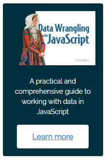

# datakit

Simple toolkit for reading and writing data CSV and JSON files in JavaScript and TypeScript under Node.js.

[Click here for API docs](https://data-forge-notebook.github.io/datakit/).

[Click here to support my work](https://www.codecapers.com.au/about#support-my-work)

## Install

Install using npm:

    npm install --save datakit

## Read and write CSV files (JavaScript)

Ready to see some code?

Here's an example of transforming a CSV file using JavaScript:

    const { readCsv, writeCsv } = require("datakit");

    function transform(record) {
        // Your function to transform a data record.
    }

    async function main() {
        const data = await readCsv("./some/file.csv");
        const transformed = data.map(transform);
        await writeCsv("./an/output/file.csv", transformed);
    }

    main()
        .then(() => console.log("Done"))
        .catch(err => {
            console.error("Something went wrong.");
            console.error(err && err.stack || err);
        });

## Read and write JSON files (TypeScript)

Here's a similar code example using TypeScript.

This time we are reading and writing JSON files:

    import { readJson, writeJson } from "datakit";

    function transform(record: InputT): OutputT {
        // Your function to transform a data record.
    }

    async function main(): Promise<void> {
        const data = await readJson("./some/file.json");
        const transformed = data.map(transform);
        await writeJson("./an/output/file.json", transformed);
    }

    main()
        .then(() => console.log("Done"))
        .catch(err => {
            console.error("Something went wrong.");
            console.error(err && err.stack || err);
        });

## Need to do more?

Consider using [Data-Forge](http://data-forge-js.com/) for data transformation, analysis and visualization in JavaScript and TypeScript.

## Resources

- [API docs](https://data-forge-notebook.github.io/datakit/)

## Support the developer 

<a target="_blank" href="https://www.codecapers.com.au/about#support-my-work">Click here to **support the developer.**</a>
